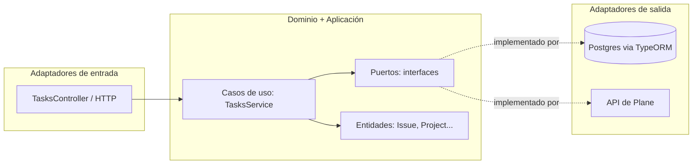

# 1. ¿Qué es la arquitectura hexagonal?

## El problema que resuelve

Imaginate que escribís el código de tu aplicación mezclado con la base de datos: tus funciones de
negocio llaman directo a `pg.query(...)`, o directo a `axios.get('https://api.plane.so/...')`.
Funciona, pero con el tiempo aparecen problemas:

- Para testear "si un issue no tiene fecha de fin no se puede sincronizar", tenés que levantar una
  base de datos real y una conexión a internet a Plane.
- Si mañana la empresa deja de usar Plane y pasa a usar Jira, tenés que reescribir código de
  negocio mezclado con detalles de la API vieja, buscando entre archivos enormes qué es "regla de
  negocio" y qué es "detalle técnico de Plane".
- El código se vuelve difícil de leer porque no se sabe, mirando una función, si lo que hace es
  "una regla del negocio" o "un detalle de cómo hablamos con Postgres".

La arquitectura hexagonal (también llamada **"puertos y adaptadores"**, inventada por Alistair
Cockburn) propone una regla simple:

> **El código que representa las reglas del negocio no debe saber nada sobre cómo se guardan los
> datos ni de dónde vienen.** Solo conoce interfaces abstractas. Quien implementa esas interfaces
> con tecnología concreta (Postgres, HTTP, Plane) vive en otro lugar, y puede reemplazarse sin
> tocar las reglas de negocio.

## El vocabulario mínimo

| Término | Qué es | Ejemplo en este proyecto |
|---|---|---|
| **Dominio** | Las entidades y las reglas de negocio puras. No hacen operaciones asíncronas, no importan nada de bases de datos ni HTTP. | La clase `Issue` en `src/tasks/domain/entities/issue.entity.ts` — sabe que "la fecha de inicio no puede ser posterior a la de fin", pero no sabe qué es Postgres. |
| **Puerto (Port)** | Una interfaz (contrato) que describe **qué necesita** el dominio/aplicación del mundo exterior, sin decir **cómo** se hace. | `IssueRepositoryPort` (`src/tasks/domain/ports/issue-repository.port.ts`): dice "necesito poder buscar un issue por id, guardarlo, borrarlo" — sin mencionar TypeORM ni SQL. |
| **Adaptador (Adapter)** | La implementación concreta de un puerto, usando una tecnología específica. | `TypeOrmIssueRepository` (`src/tasks/infrastructure/repositories/typeorm-issue.repository.ts`) implementa `IssueRepositoryPort` usando TypeORM/Postgres. |
| **Aplicación / Caso de uso** | Orquesta los puertos para cumplir una acción completa que le importa al negocio (ej. "sincronizar issues"). Sí puede ser `async`, sí coordina varios puertos, pero no sabe *cómo* cada puerto hace su trabajo internamente. | `TasksService` (`src/tasks/domain/application/tasks.service.ts`). |
| **Adaptador de entrada (inbound / driving)** | La forma en que algo *externo* dispara una acción de tu aplicación (un usuario, un cron, otra API). | `TasksController` (`src/tasks/tasks.controller.ts`) — recibe requests HTTP y llama al caso de uso. |
| **Adaptador de salida (outbound / driven)** | La forma en que tu aplicación llama a algo *externo* para cumplir su trabajo (una base de datos, una API de terceros). | `TypeOrmIssueRepository`, `PlaneApiAdapter` — tu aplicación los llama para persistir datos o traer datos remotos. |

## ¿Por qué "hexagonal"?

El nombre viene del diagrama típico: se dibuja el dominio/aplicación como un hexágono en el centro,
y alrededor los adaptadores (HTTP, Postgres, APIs externas) conectándose a través de los "lados"
del hexágono, que son los puertos. El número 6 no significa nada especial — es solo una forma
geométrica que deja espacio para dibujar varios adaptadores alrededor sin que se vea como una lista
lineal. Lo importante no es la forma, es la regla: **las flechas de dependencia siempre apuntan
hacia adentro** (infraestructura depende del dominio, nunca al revés).

Fijate que las flechas **nunca** salen del hexágono hacia Postgres o Plane directamente — todo pasa
por los puertos. Eso es lo único que hay que recordar de toda la teoría.

Seguimos en **[02-mapa-del-proyecto.md](./02-mapa-del-proyecto.md)** viendo dónde vive cada cosa en
este repo.
