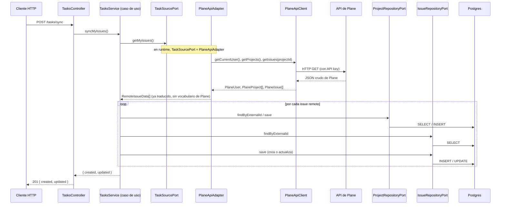

# 3. Flujo completo: `POST /tasks/sync`

Esta es la ruta que trae los issues asignados al usuario desde Plane y los guarda/actualiza en la
base de datos local. La seguimos archivo por archivo.



## Paso 1 — El controller recibe la request

`src/tasks/tasks.controller.ts`:

```ts
@Post('sync')
async sync(): Promise<{ created: number; updated: number }> {
  return this.tasksService.syncMyIssues();
}
```

El controller **no sabe nada de Plane, de Postgres, ni de cómo se decide si un issue es nuevo o ya
existía**. Solo sabe: "cuando llega un POST a `/tasks/sync`, delego todo en `tasksService`". Esa es
la única responsabilidad de un adaptador de entrada: traducir el protocolo externo (HTTP) a una
llamada al caso de uso.

## Paso 2 — El caso de uso orquesta

`src/tasks/domain/application/tasks.service.ts`, método `syncMyIssues()`:

```ts
async syncMyIssues(): Promise<{ created: number; updated: number }> {
  const remoteIssues = await this.taskSource.getMyIssues();

  let created = 0;
  let updated = 0;

  for (const raw of remoteIssues) {
    const projectId = await this.ensureProject(raw.projectExternalId, raw.projectName);

    const existing = await this.issueRepository.findByExternalId(raw.externalId);

    if (existing) {
      existing.syncFromRemote({ /* ... */ });
      await this.issueRepository.save(existing);
      updated++;
    } else {
      const issue = Issue.reconstruct({ /* ... */ });
      await this.issueRepository.save(issue);
      created++;
    }
  }

  return { created, updated };
}
```

Notá algo clave: `this.taskSource` es de tipo `TaskSourcePort` (la interfaz), **no**
`PlaneApiAdapter` (la clase concreta). `TasksService` ni siquiera importa `PlaneApiAdapter` en
ningún lado — no tiene forma de saber si detrás de `TaskSourcePort` hay Plane, Jira, o un archivo
CSV. Eso es lo que permite testear este método con una implementación falsa de `TaskSourcePort` sin
tocar ni una línea de este archivo.

`ensureProject` es un método privado de esta misma clase (más abajo en el archivo) que resuelve "si
el proyecto no existe localmente, creémoslo" usando `ProjectRepositoryPort`. Es lógica de
orquestación (decide *cuándo* crear un proyecto), no una regla de negocio de `Project` en sí (esa
vive en `Project.createFromExternal(...)`, dentro de la entidad).

## Paso 3 — El adapter traduce el mundo de Plane al mundo del dominio

`src/tasks/infrastructure/adapters/plane-api.adapter.ts`:

```ts
async getMyIssues(): Promise<RemoteIssueData[]> {
  const currentUser = await this.client.getCurrentUser();
  const projectList = await this.client.getProjects();

  const allIssues: RemoteIssueData[] = [];

  for (const rawProject of projectList) {
    const rawIssues = await this.client.getIssues(rawProject.id);
    const mine = rawIssues.filter((raw) => raw.assignees?.includes(currentUser.id));
    allIssues.push(...mine.map((raw) => this.toRemoteIssueData(raw, rawProject)));
  }

  return allIssues;
}
```

`PlaneApiAdapter implements TaskSourcePort` — es la implementación real de ese puerto. Usa
`PlaneApiClient` para pedir los datos crudos, y el método privado `toRemoteIssueData` se encarga de
la traducción: toma un `PlaneIssue` (con propiedades como `sequence_id`, `description_html`,
`state_detail`, tal como los devuelve Plane) y arma un `RemoteIssueData` (con propiedades como
`sequenceNumber`, `description`, `externalState` — el vocabulario del dominio, sin ningún rastro de
cómo habla Plane).

Este archivo es el único lugar de todo el proyecto donde conviven "cómo habla Plane" y "cómo habla
el dominio". Si mañana cambiás Plane por Jira, este archivo (y `plane-api.client.ts`/
`plane-api.types.ts`) son los únicos que se reescriben — `TasksService`, `Issue`, `Project`, el
controller, nada de eso cambia.

## Paso 4 — El cliente HTTP habla el protocolo de Plane

`src/tasks/infrastructure/clients/plane-api.client.ts` es más simple de lo que parece: es un
wrapper de Axios (vía `HttpService` de NestJS) que agrega la URL base, el API key en los headers, y
traduce errores HTTP a `HttpException` con mensajes entendibles. No sabe nada de "issues del
dominio" — solo sabe pedir URLs y devolver los tipos de `plane-api.types.ts` (`PlaneIssue`,
`PlaneProject`, etc, que son un espejo 1:1 de lo que responde la API de Plane).

## Paso 5 — Guardar en la base de datos

De vuelta en `TasksService`, cuando llama a `this.issueRepository.save(issue)`, en runtime eso
ejecuta `TypeOrmIssueRepository.save()`
(`src/tasks/infrastructure/repositories/typeorm-issue.repository.ts`):

```ts
async save(issue: Issue): Promise<void> {
  const issueOrmEntity = this.toOrm(issue);
  await this.issueRepository.save(issueOrmEntity);
}

private toOrm(issue: Issue): DeepPartial<IssueOrmEntity> {
  return {
    id: issue.id,
    name: issue.name,
    external_id: issue.externalId,
    // ...
    project: { id: issue.projectId },
    state: issue.stateId ? { id: issue.stateId } : null,
    labels: issue.labelIds.map((id) => ({ id })),
  };
}
```

De nuevo, la traducción: `issue` es una instancia de la entidad de dominio `Issue` (sin nada de
TypeORM); `toOrm()` la convierte a la forma que TypeORM necesita para hacer el `INSERT`/`UPDATE` en
Postgres.

## El punto clave de todo el flujo

En ningún momento `TasksService` (el caso de uso, el "cerebro" de la operación) importa
`TypeOrmIssueRepository`, `PlaneApiAdapter`, `PlaneApiClient`, TypeORM, ni Axios. Solo conoce
`TaskSourcePort`, `IssueRepositoryPort` y `ProjectRepositoryPort` — interfaces. Quién implementa
esas interfaces en runtime lo decide un solo archivo, que vemos en el próximo capítulo:
`tasks.module.ts`.

Seguimos con un flujo más simple en **[04-flujo-lectura.md](./04-flujo-lectura.md)**.
