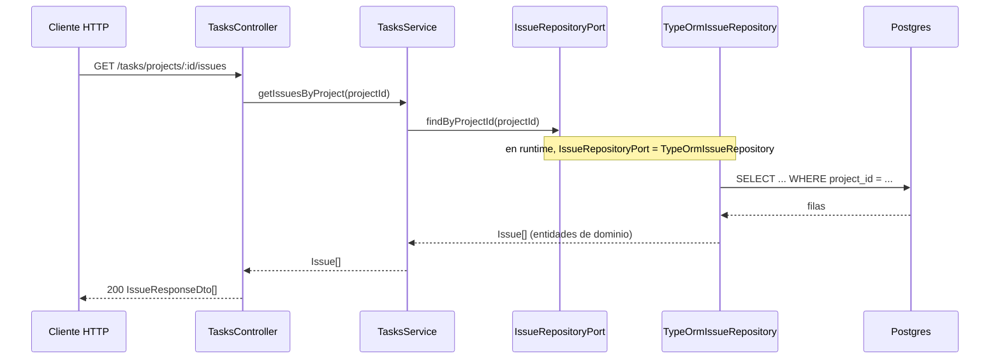

# 4. Flujo completo: `GET /tasks/projects/:projectId/issues`

Este flujo es más corto que el de sync, y sirve para mostrar el patrón en su versión más simple: un
endpoint de solo lectura.



## Paso 1 — Controller

```ts
@Get('projects/:projectId/issues')
async findByProject(
  @Param('projectId') projectId: string,
): Promise<IssueResponseDto[]> {
  const issues = await this.tasksService.getIssuesByProject(projectId);
  return issues.map((issue) => this.toResponseDto(issue));
}
```

Dos cosas para notar acá:

1. El controller llama a `this.tasksService.getIssuesByProject(...)` — **no** a un repositorio
   directamente. Esto importa: si mañana necesitás agregar una regla como "no devolver issues
   archivadas" o "solo el dueño del proyecto puede listar sus issues", ese código va a vivir en
   `TasksService`, un solo lugar, sin importar cuántos controllers terminen llamando a esa función.
2. `this.toResponseDto(issue)` es la conversión de entidad de dominio (`Issue`) a DTO de salida
   (`IssueResponseDto`, en `src/tasks/dto/issue-response.dto.ts`). Esta conversión sí puede vivir en
   el controller porque es un detalle de **presentación** (qué forma tiene el JSON que devuelve la
   API), no una regla de negocio.

## Paso 2 — Caso de uso

```ts
async getIssuesByProject(projectId: string): Promise<Issue[]> {
  return this.issueRepository.findByProjectId(projectId);
}
```

Este caso de uso es tan simple que solo delega — no hay nada más que orquestar todavía. Pero está
ahí, y no en el controller, para que el día que aparezca una regla de negocio para esta operación,
ya tenga un lugar natural donde vivir sin tener que reestructurar nada.

## Paso 3 — Repositorio (adaptador de salida)

```ts
async findByProjectId(projectId: string): Promise<Issue[]> {
  const issueOrmEntities = await this.issueRepository.find({
    where: { project: { id: projectId } },
    relations: { project: true, state: true, labels: true },
  });

  return issueOrmEntities.map((issueOrmEntity) => this.toDomain(issueOrmEntity));
}
```

Acá sí aparece TypeORM, SQL, `relations` — todo el detalle técnico de cómo se consulta Postgres.
`this.toDomain(...)` convierte cada fila de la tabla (`IssueOrmEntity`) de vuelta a una entidad de
dominio (`Issue`), para que todo lo que esté "para adentro" del hexágono (el caso de uso, el
controller) trabaje siempre con `Issue`, nunca con `IssueOrmEntity`.

## Por qué vale la pena el "molesto" paso extra por el caso de uso

Para un endpoint tan simple como este, pasar por `TasksService` puede parecer una capa de más — el
controller podría llamar directo al repositorio y ahorrarse una línea. La razón por la que **no**
se hace así es la consistencia: si algunos endpoints pasan por el caso de uso y otros no, cualquiera
que lea el código tiene que revisar caso por caso para saber "¿esta ruta tiene lógica de negocio
escondida en el controller, o no?". Con la regla fija de "el controller siempre llama al caso de
uso, nunca a un puerto directo", esa pregunta no hace falta hacerla nunca.

Seguimos viendo cómo se conecta todo esto en runtime en
**[05-inyeccion-de-dependencias.md](./05-inyeccion-de-dependencias.md)**.
